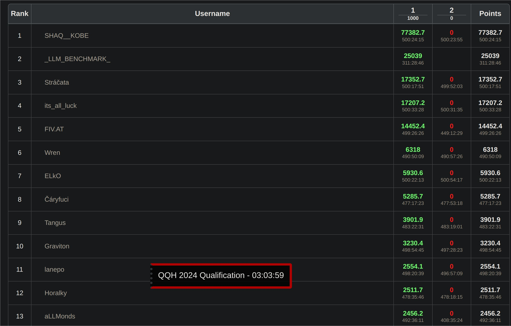
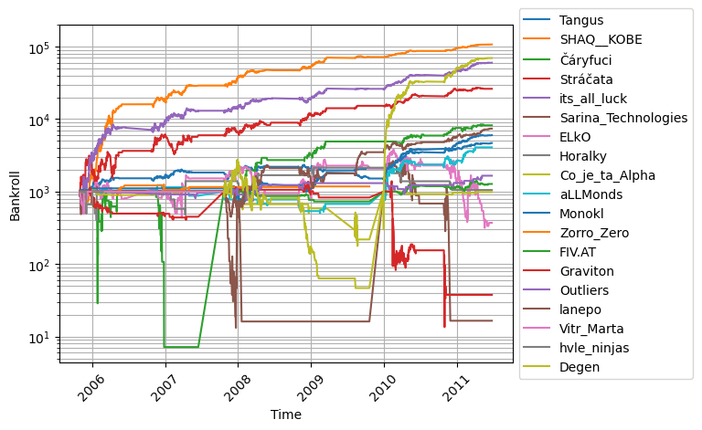
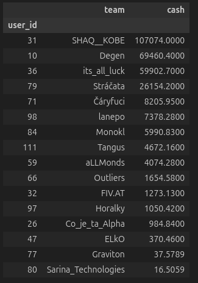

# #1 Team - SHAQ & KOBE QMiners 2024 hackathon post-mortem

## Team members

Adam Bobocky (https://www.linkedin.com/in/adam-bobocky-a4890b198/)

Vojtěch Kolomazník (https://www.linkedin.com/in/vojtech-kolomaznik/)

## Competition description

We have received an 35 years NBA team box score and player box score data along with made up odds from the organizers.

Our goal was to output our betting decisions to maximize profit.

## Post-mortem

### First stage

After the competition started I laid out my plan to efficiently build a strong model.

In order I did:
* literature review by searching relevant keywords on Google Scholar, Medium, past Kaggle competitions, Reddit posts to catch up on public knowledge of NBA modelling
* reading up on data analytics literature around basketball, as I had 0 basketball knowledge before the competition
* data exploration in `research/` to verify various theories I have developed
* compiled a list of "factors" which we believe influence the outcome of a game (`FACTOR_IMPORTANCE.md`)
* built a backtesting and ensambling framework to test out models (`src/meta_model/`)

The idea for the prediction model was to maximize information entropy by having sub-models predict the score difference, and the meta_model be a logistic regression that ensembles them to predict the final binary outcome (home or away win).

The final model was an ensemble of:

* linear regression with l2 regularization of past score differences (this was the most informative sub-model)
* custom player-level neural network model
* Nate Silver NBA Elo model
* basketball pythagorean model
* basketball four factor model
* custom exhaustion features

We had an online system to submit our predictions on out of sample data, and had a limit of 20 submissions.

I decided to not poke the bear, and thus artificially limit the profit of my model to 1/10th, so that other competitors don't try harder to beat us. Even then I managed to hold top3 placement throughout the competition, only revealing the true score the last few hours.

With a score of 77382, I solo managed to get profit equal to the rest of the competitors combined. (You start with 1000 points, so that is not part of your profit and the second place did not fulfill the competition participation requirements, so they could not attend).

### Second stage preparation

The second stage was in-person finals over a single Saturday, where we got new data increments and were supposed to make our predictions for new data. The scores were reset, and the time horizon shortened, thus introducing more variance to the competition.

Trying to combat this I have developed `risk_model/` to make a simple simulation of how the final day could look like and what decisions to make to maximize win probability.

It is a simple script that simulates the tournament format, using optuna to optimize kelly fraction to maximize the probability of winning the tournament.

It assumes each of the 20 competitors attending the finals start with the same 1000 points, each has varying model quality and risk apetite, while assuming all the models are correlated to varying degrees, account for the "Quant" factor. (https://web.mit.edu/Alo/www/Papers/august07.pdf)

### Finals day

After building a strong model and determining our chosen optimal strategy, we have arrived at the finals.

It was split into 3 rounds, where we instantly took lead in the first round, furthering it in the second round.

Decyphering the scrambled dataset we have found out that the third round data is happening shortly after covid, and given our lead in the competition was large enough, I chose to halve the risked amount, so we don't potentially lose out on our first place lead if others models adjust better for that age. This was a minor mistake, as the model performed the best during this time, but we still maintained a dominant first place lead.

If I did not halve the risk amount, our final score would come out at around 143,000 which does not manage to beat all the other scores combined like I did in the first stage, but still best by far.

### Conclusion

The competition was very fun, including the interactive, meta-game elemenet of the first round where we theorized heavily about what models are the others using, seeing their RAM usage, runtime, and score. Working on improving the model and preparing for the finals. And the finals day itself was a blast, with the organizers providing a great environment, food, and drinks, and networking opportunities.

Due to the rules, after winning first place we cannot participate in the future editions of the competition, and thus I am making my solution and post-mortem public to up the competition for the next years.

## Footnotes

The codebase is a mess, best code practices not followed. Well aware, it was a time-limited hackathon, it started out pretty and ended up like this by the ending time-crunch.

Additionally, I have attempted to backtest my model on real life odds, and it seemed to be profitable, but I may have some bugs in my implementation, as this was post-competition and I did not spend much time on it.

To not make this document too long I had to leave out most of the details, so if you are interested to discuss anything, ping me on LinkedIn.
